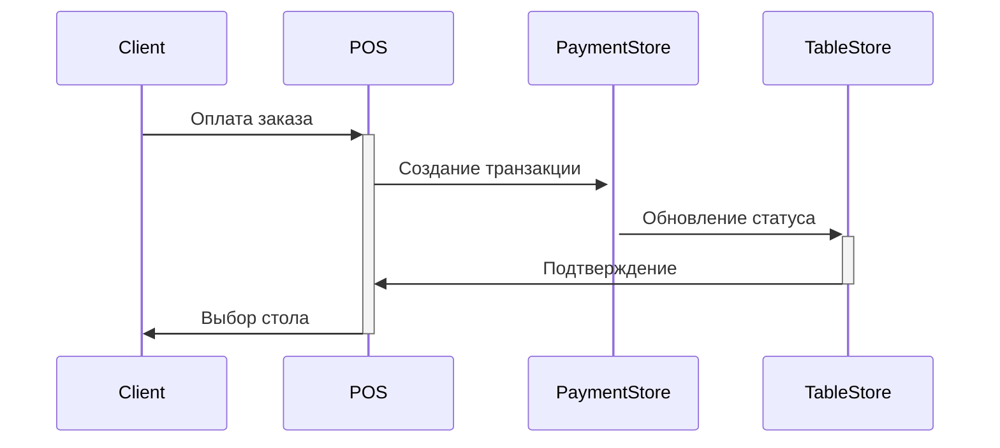
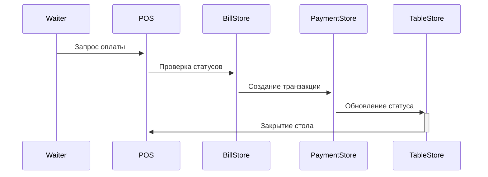

# Система оплаты и закрытия заказов

## 1. Структура данных

### 1.1 Статусы и их взаимосвязь

```typescript
// Статус оплаты
type PaymentStatus = 'unpaid' | 'partially_paid' | 'paid'

// Статус позиции заказа
type OrderItemStatus = 'pending' | 'cooking' | 'completed' | 'cancelled'

// Статус стола
type TableStatus = 'free' | 'occupied_unpaid' | 'occupied_paid' | 'reserved'
```

### 1.2 Расширение существующих интерфейсов

```typescript
interface Table {
  paymentStatus?: {
    totalAmount: number
    paidAmount: number
    lastPaymentId?: string
    lastPaymentTime?: string
  }
}

interface BillItem {
  paymentStatus: PaymentStatus
  paymentTransactionId?: string
  paymentTimestamp?: string
}

interface Bill {
  paymentStatus: PaymentStatus
  payments: {
    transactionId: string
    amount: number
    timestamp: string
  }[]
}
```

## 2. Процессы и валидация

### 2.1 Процесс оплаты

1. Выбор позиций для оплаты
2. Проверка возможности оплаты
3. Создание транзакции
4. Обновление статусов:
   - Позиций заказа
   - Счета
   - Стола
5. Создание связей с транзакцией

### 2.2 Процесс закрытия заказа

1. Валидация возможности закрытия:
   - Все позиции оплачены
   - Все блюда приготовлены/выданы
   - Нет активных процессов
2. Закрытие заказа
3. Обновление статуса стола

### 2.3 Правила валидации

```typescript
interface ValidationRules {
  canPayItems: (items: string[]) => boolean
  canCloseBill: (billId: string) => boolean
  canCloseOrder: (orderId: string) => boolean
  canFreeTable: (tableId: string) => boolean
}
```

## 3. UI компоненты

### 3.1 Индикаторы статуса

- TableStatusBadge - индикатор статуса стола
- PaymentStatusIndicator - индикатор статуса оплаты
- OrderItemStatus - индикатор статуса позиции

### 3.2 Диалоги

- PaymentDialog - диалог оплаты
- CloseOrderDialog - подтверждение закрытия заказа
- TableActionMenu - меню действий со столом

### 3.3 Информационные компоненты

- PaymentSummary - сводка по оплате
- TransactionsList - список связанных транзакций
- OrderStatusSummary - сводка по статусам позиций

## 4. Реализация по шагам

### 4.1 Этап 1: Базовая структура (2 дня)

1. Обновление типов и интерфейсов
2. Расширение существующих сторов
3. Добавление базовых валидаторов

### 4.2 Этап 2: UI компоненты (3 дня)

1. Реализация индикаторов статуса
2. Создание диалогов
3. Добавление информационных компонентов

### 4.3 Этап 3: Процессы (3 дня)

1. Реализация процесса оплаты
2. Реализация процесса закрытия
3. Связывание с транзакциями

### 4.4 Этап 4: Интеграция (2 дня)

1. Интеграция с существующим UI
2. Добавление контекстных меню
3. Реализация переходов между статусами

## 5. Сценарии использования

### 5.1 Предоплата и рассадка



### 5.2 Оплата после обслуживания



## 6. Визуальное оформление

### 6.1 Цветовая схема статусов

```scss
.status {
  &--unpaid {
    color: var(--color-warning);
  }
  &--paid {
    color: var(--color-success);
  }
  &--processing {
    color: var(--color-info);
  }
}
```

### 6.2 Индикаторы

- Использовать иконки для быстрой идентификации
- Добавить тултипы с деталями
- Реализовать анимации при изменении статуса

## 7. Тестирование

### 7.1 Сценарии тестирования

1. Оплата части заказа
2. Полная оплата
3. Закрытие заказа
4. Перенос заказа между столами
5. Закрытие стола

### 7.2 Валидации

1. Попытка оплаты несуществующих позиций
2. Попытка закрытия неоплаченного заказа
3. Попытка освобождения стола с активными заказами

## 8. API методов

### 8.1 PaymentStore

```typescript
interface PaymentStore {
  // Оплата
  processPayment(data: PaymentData): Promise<PaymentResult>
  validatePayment(data: PaymentData): ValidationResult

  // Статусы
  updatePaymentStatuses(payment: Payment): Promise<void>
  getPaymentsByBill(billId: string): Payment[]

  // Транзакции
  getTransactionDetails(transactionId: string): Transaction
}
```

### 8.2 TableStore

```typescript
interface TableStore {
  // Статусы
  updateTableStatus(tableId: string, status: TableStatus): Promise<void>
  validateTableStatus(tableId: string): ValidationResult

  // Операции
  closeTable(tableId: string): Promise<void>
  freeTable(tableId: string): Promise<void>

Итоги текущей сессии:

Обновили и структурировали типы:

typescriptCopy- PaymentStatus: 'unpaid' | 'partially_paid' | 'paid'
- PaymentTransactionStatus: 'completed' | 'cancelled' | 'pending' | 'failed'
- TableStatus: 'free' | 'occupied_unpaid' | 'occupied_paid' | 'reserved'

Расширили интерфейсы для платежей:


Добавили PaymentStatus в BillItem и Bill
Добавили структуру для платежей в TableStatus
Добавили BillPayment для хранения истории


Реализовали базовые валидаторы в validation.ts:


validatePayment для проверки возможности оплаты
validateTableStatus для проверки статусов столов
Обновили существующие валидаторы с учетом платежей


Подготовили структуру для валидации заказов:


validateOrderPayment
validateOrderClose
validateOrderStatus

Рекомендации на следующую сессию:

Расширить PaymentStore:

typescriptCopy- Добавить обновление статусов позиций
- Добавить методы для работы с транзакциями
- Реализовать интеграцию с BillStore и TableStore

Реализовать последовательность процесса оплаты:

typescriptCopyClient -> POS -> PaymentStore -> TableStore

Подготовить UI-компоненты:


TableStatusBadge
PaymentStatusIndicator
OrderItemStatus


Обновить PaymentDialog с учетом новой структуры данных

С чего предпочтительнее начать следующую сессию?
```
