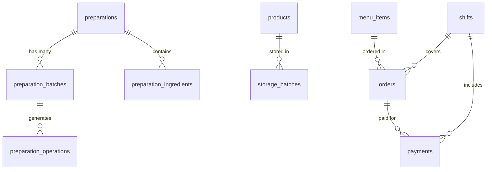

# Database Schema Reference

## Core Tables (Quick Reference)

### preparation\_\* (Preparation Management)

- `preparations` - Main recipes/semi-finished products
- `preparation_batches` - Individual batches with quantities
- `preparation_operations` - Production/consumption/write-off operations
- `preparation_ingredients` - Recipe components
- `preparation_balances` - ~~DEPRECATED~~ Calculated from batches

### storage\_\* (Warehouse)

- `storage_batches` - Ingredient batches
- `storage_operations` - Warehouse operations
- `warehouses` - Storage locations

### products & menu

- `products` - Raw ingredients catalog
- `menu_items` - Final menu items
- `menu_categories` - Menu organization

### orders & POS

- `orders` - Customer orders
- `payments` - Payment records
- `shifts` - Cashier shifts
- `tables` - Restaurant tables

## Key Relationships



## Frequently Used Columns

### preparation_batches

```sql
- id (UUID)
- preparation_id (UUID)
- current_quantity (numeric)
- cost_per_unit (numeric)
- status ('active' | 'expired' | 'depleted')
- department ('kitchen' | 'bar')
- batch_number (text)
- expires_at (timestamptz)
```

### storage_batches

```sql
- id (text)
- item_id (text)
- current_quantity (numeric)
- cost_per_unit (numeric)
- expiry_date (timestamptz)
- status ('active' | 'expired' | 'consumed')
```

## Common Queries (Keep Handy)

```sql
-- Get current preparation balances (NEW METHOD)
SELECT
  p.name,
  pb.department,
  SUM(pb.current_quantity) as total_quantity,
  AVG(pb.cost_per_unit) as avg_cost
FROM preparation_batches pb
JOIN preparations p ON pb.preparation_id = p.id
WHERE pb.status = 'active' AND pb.current_quantity > 0
GROUP BY p.id, p.name, pb.department;

-- Check batch expiry
SELECT batch_number, expires_at, current_quantity
FROM preparation_batches
WHERE expires_at < NOW() + INTERVAL '2 days'
AND status = 'active';
```

## Tips for MCP Usage

1. **Use specific queries instead of listing tables**
2. **Cache table structure locally**
3. **Use WHERE clauses to limit results**
4. **Prefer JOIN over multiple queries**

## Schema Change Process

1. Update this file first
2. Create migration
3. Update TypeScript types
4. Update mappers
5. Test with specific queries
