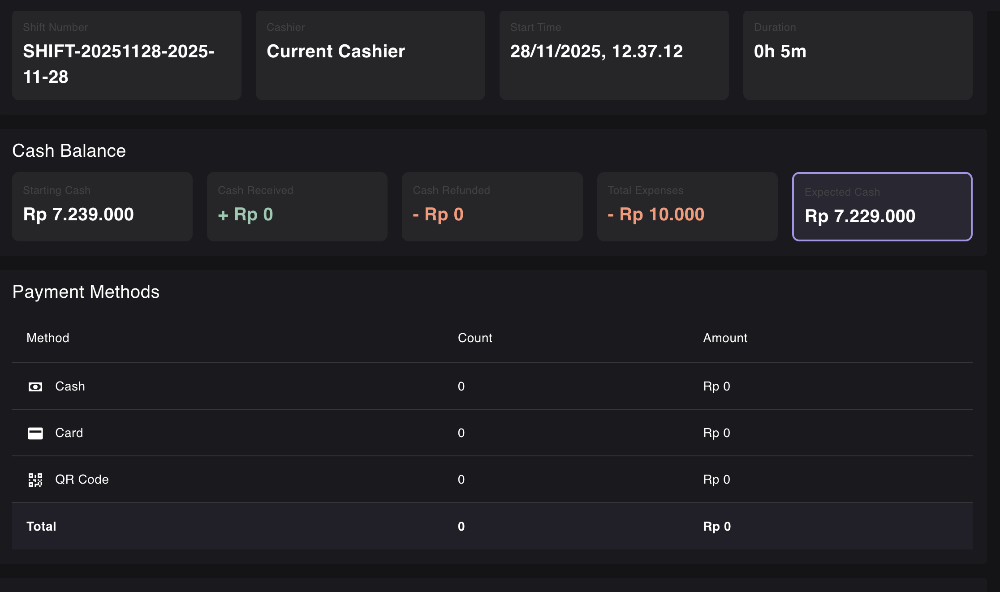

Давай проверим как мы завершаем смены, у меня есть проблемы:

1. статус не обновляется правильно:
    в backoffice не отображается платежи, хотя при закрытии они были.

2. Main Cash Register - не записаны приходы или расходы по смене в аккаунте, который привязан как касса.

3. соответственно, когда генерируется P&L report не подгружаются расходы. http://localhost:5174/analytics/pl-report - надо тоже смотреть как мы их записываем.
