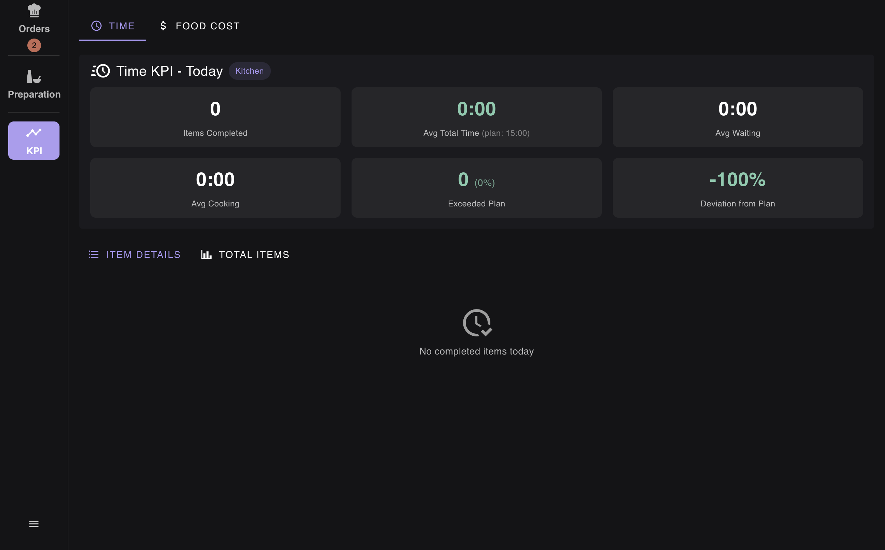

# Kitchen Monitor - User Guide

This guide describes the Kitchen Monitor interface and its main features.

---

## 1. Login

To access Kitchen Monitor, you need to log in using a PIN code.

### Steps:

1. Open the application
2. Select the **KITCHEN** tab at the top
3. Enter your PIN code (for kitchen staff: `1111`)
4. Click **LOGIN**

> **Note:** In development mode, test PINs are displayed for quick access:
>
> - Kitchen: `1111`
> - Bar: `2222`

---

## 2. Main Interface - Orders

After logging in, you will see the main Orders screen.

### Interface Elements:

#### Left Sidebar (Navigation)

- **Orders** - View incoming orders (with badge showing count)
- **Preparation** - Manage semi-finished products
- **KPI** - View performance metrics

#### Main Area - Order Columns

**Waiting Column:**

- Shows orders waiting to be prepared
- Each card displays:
  - Order number (e.g., `ORD-20251213-6509`)
  - Wait time (in red if overdue)
  - Dish name and size
  - Order type (Dine-in/Delivery/Takeaway)
  - Table number (for dine-in orders)
  - **START COOKING** button

**Cooking Column:**

- Shows orders currently being prepared
- Empty state: "No dishes cooking"

#### Order Card Details:

- **Yellow badge**: Order number
- **Timer**: Shows how long the order has been waiting
- **Customizations**: Special modifications (highlighted in red box)
- **Order type badges**: Dine-in (purple), Delivery (orange)

### Actions:

- Click **START COOKING** to move an order to the Cooking column
- Click **DONE** (on cooking items) to mark as completed

---

## 3. Preparation Management

The Preparation screen helps manage semi-finished products and daily production schedule.

### Top Actions Bar:

- **Refresh** - Reload data
- **Generate Schedule** - Auto-generate production tasks
- **New Production** - Create manual production entry
- **Write-off Prep** - Write off semi-finished products
- **Write-off Product** - Write off raw products

### Tabs:

1. **Production Schedule** (50) - Daily tasks to prepare
2. **Stock List** (57) - Current inventory
3. **History** - Past production records

### Task Categories:

**Urgent (Red):**

- Items that are out of stock or expiring today
- Requires immediate attention
- Shows "Out of stock - no inventory" status

**Morning (6:00 - 12:00):**

- Tasks scheduled for morning shift
- Shows "Near expiry" warnings

### Task Card Information:

- Product name (e.g., "Dorado unfrozen")
- Required quantity (e.g., "Need: 1 pcs (120g)")
- Status indicator
- Action buttons: **Start** / **Done**

---

## 4. KPI Dashboard

The KPI screen shows kitchen performance metrics.

### KPI Tabs:

- **Time** - Time-based performance metrics
- **Food Cost** - Cost analysis (separate tab)

### Time KPI Metrics:

| Metric              | Description                                         |
| ------------------- | --------------------------------------------------- |
| Items Completed     | Total dishes completed today                        |
| Avg Total Time      | Average time from order to completion (plan: 15:00) |
| Avg Waiting         | Average time orders spend waiting                   |
| Avg Cooking         | Average cooking time                                |
| Exceeded Plan       | Orders that took longer than planned                |
| Deviation from Plan | Percentage deviation from target time               |

### Detail Views:

- **Item Details** - Per-item breakdown
- **Total Items** - Aggregated statistics

---

## Navigation Tips

1. **Quick Switch**: Use the left sidebar to quickly switch between Orders, Preparation, and KPI
2. **Badge Indicators**: Numbers on tabs show pending items
3. **Real-time Updates**: Data updates automatically via WebSocket
4. **Screen Lock**: Kitchen display keeps the screen awake during operation

---

## Keyboard Shortcuts

| Action                       | Description             |
| ---------------------------- | ----------------------- |
| Menu button (hamburger icon) | Open additional options |
| Collapse button (<<)         | Minimize/expand columns |

---

_Generated with Playwright automated documentation_
