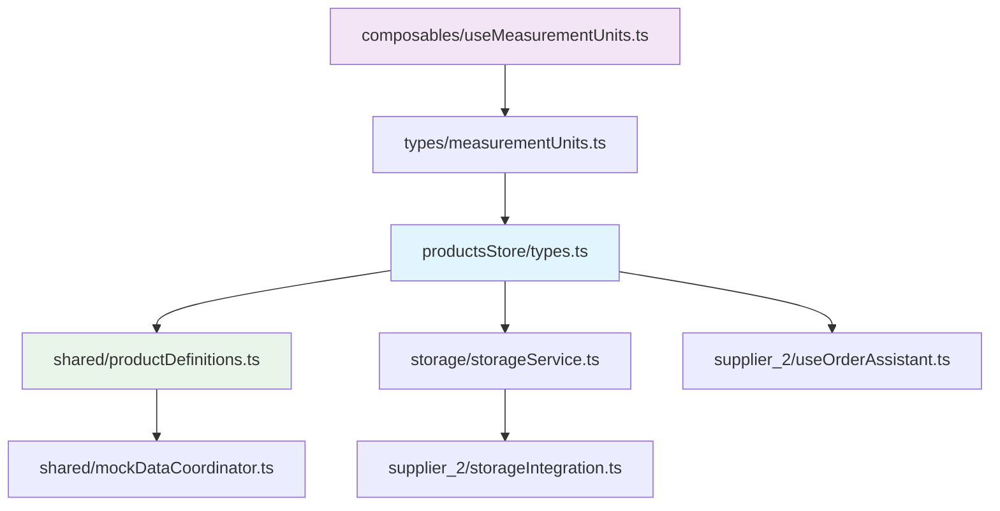

---

## 🔄 Правила работы с composable и API

### Использование useMeasurementUnits

```typescript
import {
  useMeasurementUnits,
  useProductUnits,
  convertToBaseUnits
} from '@/composables/useMeasurementUnits'

// Основной composable (заменяет ВСЕ старые системы)
const {
  convertUnits,              // Основная конвертация между любыми единицами
  safeConvertUnits,         // Безопасная конвертация с обработкой ошибок
  formatQuantity,           // Форматирование "150 грамм", "2.5 кг"
  validateUnitForContext,   // Проверка подходит ли единица для продуктов/рецептов/меню
  getUnitOptions,           // Опции для <select> компонентов
  getSuggestedUnit          // Предлагает лучшую единицу (1200г → кг)
} = useMeasurementUnits()

// Специализированные composables (рекомендуется)
const { units: productUnits, unitOptions, validateUnit } = useProductUnits()
const { units: recipeUnits } = useRecipeUnits()
const { units: menuUnits } = useMenuUnits()
```

### Правильный импорт и использование

```typescript
// ✅ ПРАВИЛЬНО - новая унифицированная система
import {
  useMeasurementUnits,
  convertToBaseUnits
} from '@/composables/useMeasurementUnits'

// ❌ НЕ ИСПОЛЬЗУЙТЕ - устаревшие импорты
// import { useProductUnits } from '@/composables/useProductUnits'  // УДАЛЕНО
// import { convertToBaseUnits } from '@/utils/currency'             // УСТАРЕЛО
```

### Безопасная конвертация с обработкой ошибок

```typescript
const { safeConvertUnits, formatQuantity } = useMeasurementUnits()

// Безопасная конвертация
const result = safeConvertUnits(100, 'kg', 'gram')
if (result.success) {
  console.log(`Converted: ${formatQuantity(result.value!, 'gram')}`)
} else {
  console.error(`Conversion failed: ${result.error}`)
  // Fallback логика
}

// Валидация единицы для контекста
const validation = validateUnitForContext('tablespoon', 'products')
if (!validation.valid) {
  console.error(`Invalid unit: ${validation.error}`)
}
```

### Работа с Product utility-функциями

```typescript
import {
  hasBaseUnitsStructure,
  getProductBaseUnit,
  getProductBaseCost,
  enhanceProduct
} from '@/stores/productsStore/types'

// Проверка и улучшение продукта
function processProduct(product: Product) {
  // Проверяем есть ли новая структура
  if (!hasBaseUnitsStructure(product)) {
    // Автоматически определя---

## 🎛️ Правильная конфигурация продуктов

### Примеры из вашей системы

#### Beef Steak (мясо)
```typescript
{
  // Базовые единицы для точных расчетов
  baseUnit: 'gram',
  baseCostPerUnit: 180,          // 180 IDR за грамм

  // Единицы закупки (как покупаем)
  purchaseUnit: 'kg',
  purchaseToBaseRatio: 1000,     // 1 кг = 1000 грамм
  purchaseCost: 180000,          // 180,000 IDR за кг

  // Управление остатками
  minStock: 2000,                // 2 кг минимум (в граммах)
  maxStock: 10000,               // 10 кг максимум
  dailyConsumption: 2500,        // 2.5 кг в день
  yieldPercentage: 95,           // 95% выход после обработки
  shelfLifeDays: 5,              // Хранится 5 дней
  leadTimeDays: 3                // Поставка за 3 дня
}
```

#### Milk (жидкость)
```typescript
{
  baseUnit: 'ml',
  baseCostPerUnit: 15,           // 15 IDR за мл

  purchaseUnit: 'liter',
  purchaseToBaseRatio: 1000,     // 1 литр = 1000 мл
  purchaseCost: 15000,           // 15,000 IDR за литр

  minStock: 500,                 // 500 мл минимум
  maxStock: 5000,                // 5 литров максимум
  dailyConsumption: 1000,        // 1 литр в день
  yieldPercentage: 100,          // 100% выход
  shelfLifeDays: 7               // Хранится 7 дней
}
```

#### Bintang Beer (штучный товар)
```typescript
{
  baseUnit: 'piece',
  baseCostPerUnit: 8000,         // 8,000 IDR за бутылку

  purchaseUnit: 'pack',
  purchaseToBaseRatio: 24,       // 1 упаковка = 24 бутылки
  purchaseCost: 192000,          // 192,000 IDR за упаковку

  minStock: 12,                  // 12 бутылок минимум
  maxStock: 120,                 // 5 упаковок максимум
  canBeSold: true,               // Можно продавать
  yieldPercentage: 100
}
```

#### Black Pepper (специи)
```typescript
{
  baseUnit: 'gram',
  baseCostPerUnit: 120,          // 120 IDR за грамм

  purchaseUnit: 'kg',
  purchaseToBaseRatio: 1000,     // 1 кг = 1000 грамм
  purchaseCost: 120000,          // 120,000 IDR за кг

  minStock: 100,                 // 100 грамм минимум
  dailyConsumption: 50,          // 50 грамм в день
  yieldPercentage: 100,          // Специи не теряют вес
  shelfLifeDays: 365,            // Долгое хранение
  leadTimeDays: 7                // Недельная поставка
}
```# 📊 Инструкция: Система расчета стоимости продуктов и единиц измерения

## 🎯 Цель документа
Это руководство описывает правильное использование системы единиц измерения и расчетов стоимости в приложении, чтобы обеспечить точность всех расчетов и корректную конвертацию единиц.

---

## 📁 Ключевые файлы системы

### 1. Основные типы и интерфейсы

- **`src/stores/productsStore/types.ts`** - 🎯 **ГЛАВНЫЙ ФАЙЛ** с типами продуктов и utility-функциями
- **`src/types/measurementUnits.ts`** - Базовые типы единиц измерения (MeasurementUnit, UnitType)
- **`src/composables/useMeasurementUnits.ts`** - 🔧 **ЕДИНЫЙ COMPOSABLE** для работы с единицами (ЗАМЕНЯЕТ все старые)
- **`src/stores/shared/productDefinitions.ts`** - Определения продуктов с реальными примерами и валидацией

### 2. Служебные файлы

- **`src/stores/storage/storageService.ts`** - Служба складского учета и расчета балансов
- **`src/stores/supplier_2/composables/useOrderAssistant.ts`** - Помощник заказов и рекомендаций
- **`src/stores/shared/mockDataCoordinator.ts`** - Координатор тестовых данных и валидации

### 3. Интеграционные файлы

- **`src/stores/supplier_2/integrations/storageIntegration.ts`** - Интеграция с системой складского учета
- **`src/views/supplier_2/components/shared/BaseOrderAssistant.vue`** - UI компонент для работы с заказами
- **`src/views/supplier_2/components/procurement/RequestDetailsDialog.vue`** - Детали заявок на закупку

### 🔗 Взаимосвязи файлов



---

## 🏗️ Архитектура системы единиц измерения

### Двойная система единиц

Система использует **двойную структуру единиц** для обеспечения точности расчетов:

#### 1. Базовые единицы (для расчетов)

```typescript
export type BaseUnit = 'gram' | 'ml' | 'piece'
```

**Правила определения базовой единицы:**

- **`gram`** - для твердых продуктов (мясо, овощи, специи, крупы)
- **`ml`** - для жидкостей (молоко, масло, соки)
- **`piece`** - для штучных товаров (напитки в бутылках/банках)

#### 2. Полные единицы измерения (MeasurementUnit)

```typescript
// Из @/types/measurementUnits импортируются:
export type MeasurementUnit =
  // Вес
  | 'gram'
  | 'kg'
  // Объем
  | 'ml'
  | 'liter'
  // Штучные
  | 'piece'
  | 'pack'
  // Кулинарные (если есть)
  | 'teaspoon'
  | 'tablespoon'
  | 'cup'

export type UnitType = 'weight' | 'volume' | 'piece' | 'culinary'

// Константы из файла types/measurementUnits.ts
const PRODUCT_UNITS = ['gram', 'kg', 'ml', 'liter', 'piece', 'pack']
```

#### 3. Единицы закупки (для удобства ввода)

```typescript
purchaseUnit: MeasurementUnit // Как покупаем (кг, литр, упаковка)
purchaseToBaseRatio: number // Коэффициент конвертации
```

**Пример взаимосвязей:**

- Beef Steak: закупаем в `кг`, храним расчеты в `граммах` (ratio: 1000)
- Milk: закупаем в `литрах`, храним в `мл` (ratio: 1000)
- Beer: закупаем `упаковками`, учитываем в `штуках` (ratio: 24)

### Основная структура Product

```typescript
export interface Product extends BaseEntity {
  // ✅ СТАРЫЕ ПОЛЯ (для совместимости)
  unit: MeasurementUnit // Старая единица
  costPerUnit: number // Старая цена за единицу

  // 🆕 НОВЫЕ ПОЛЯ (базовые единицы)
  baseUnit?: BaseUnit // gram, ml, или piece
  baseCostPerUnit?: number // Цена за базовую единицу в IDR

  // 🛒 ЕДИНИЦЫ ЗАКУПКИ
  purchaseUnit?: MeasurementUnit // Как покупаем
  purchaseToBaseRatio?: number // Коэффициент: 1 закупочная = X базовых
  currentPurchasePrice?: number // Цена за закупочную единицу

  // 📦 УПРАВЛЕНИЕ СКЛАДОМ
  minStock?: number // Минимальный остаток
  maxStock?: number // Максимальный остаток
  shelfLife?: number // Срок годности (дни)
  yieldPercentage: number // Выход при обработке (%)
}
```

---

## 🔧 Ключевые utility-функции

### 1. Проверка структуры продукта

```typescript
hasBaseUnitsStructure(product: Product): boolean
```

**Назначение:** Проверяет, есть ли у продукта новая структура с базовыми единицами.
**Файл:** `src/stores/productsStore/types.ts`

### 2. Определение базовой единицы

```typescript
getProductBaseUnit(product: Product): BaseUnit
```

**Логика определения:**

- Если `product.baseUnit` существует → возвращает его
- Иначе определяет автоматически по категории:
  - `meat`, `vegetables`, `spices`, `cereals` → `gram`
  - `dairy` + содержит "milk" → `ml`
  - `beverages` → `piece`
  - Содержит "oil" или "liquid" → `ml`
  - По умолчанию → `gram`

### 3. Расчет базовой стоимости

```typescript
getProductBaseCost(product: Product): number
```

**Логика расчета:**

- Если `product.baseCostPerUnit` существует → возвращает его
- Иначе рассчитывает из старых данных:
  - `gram` + `kg` → `costPerUnit / 1000`
  - `ml` + `liter` → `costPerUnit / 1000`

### 4. Конвертация в базовые единицы

```typescript
convertToBaseUnits(quantity: number, fromUnit: MeasurementUnit, baseUnit: BaseUnit): number
```

**Файл:** `src/stores/productsStore/types.ts`

**Коэффициенты конвертации:**

```typescript
const conversions = {
  // Вес
  gram: { gram: 1 },
  kg: { gram: 1000 },

  // Объем
  ml: { ml: 1 },
  liter: { ml: 1000 },

  // Штучные
  piece: { piece: 1 },
  pack: { piece: 1 }
}
```

### 5. Расширение продукта

```typescript
enhanceProduct(product: Product): Product & { baseUnit: BaseUnit, baseCostPerUnit: number }
```

**Назначение:** Создает расширенную версию продукта с автоматически рассчитанными базовыми единицами.

### 6. Composable функции (useMeasurementUnits)

```typescript
// Из src/composables/useMeasurementUnits.ts
const {
  convertUnits, // Основная конвертация
  safeConvertUnits, // Безопасная конвертация с обработкой ошибок
  formatQuantity, // Форматирование с единицами
  validateUnitForContext, // Валидация единицы для контекста
  getUnitOptions, // Опции для select компонентов
  getSuggestedUnit // Рекомендуемая единица для значения
} = useMeasurementUnits()

// Специализированные composables
const { units, unitOptions, validateUnit } = useProductUnits()
const { units: recipeUnits } = useRecipeUnits()
const { units: menuUnits } = useMenuUnits()
```

---

## 📊 Система управления остатками

### Интерфейсы для управления остатками

#### StockRecommendation (автоматические рекомендации)

```typescript
export interface StockRecommendation extends BaseEntity {
  productId: string
  currentStock: number
  recommendedMinStock: number // Рекомендуемый минимум (автоматически)
  recommendedMaxStock: number // Рекомендуемый максимум (автоматически)
  recommendedOrderQuantity: number // Рекомендуемое количество заказа
  daysUntilReorder: number // Дней до следующего заказа
  urgencyLevel: 'low' | 'medium' | 'high' | 'critical'

  factors: {
    averageDailyUsage: number // Среднее дневное потребление
    leadTimeDays: number // Время поставки
    safetyDays: number // Страховой запас
    seasonalFactor?: number // Сезонный коэффициент
  }
  calculatedAt: string
  isActive: boolean
}
```

#### Ручные настройки в Product

```typescript
// Поля в основном интерфейсе Product
minStock?: number                 // Ручная настройка минимума
maxStock?: number                 // Ручная настройка максимума
leadTimeDays?: number            // Время поставки от поставщика
```

### Параметры расчета остатков

```typescript
export interface StockCalculationParams {
  safetyDays: number // Страховой запас в днях (обычно 7-14)
  maxOrderDays: number // Максимальный запас в днях (обычно 30-60)
  seasonalFactors?: Record<string, number> // Сезонные коэффициенты
  volatilityThreshold: number // Порог волатильности потребления
}
```

### Мониторинг потребления

```typescript
export interface ProductConsumption extends BaseEntity {
  productId: string
  dailyAverageUsage: number // В базовых единицах
  weeklyAverageUsage: number // В базовых единицах
  monthlyAverageUsage: number // В базовых единицах
  trend: 'increasing' | 'decreasing' | 'stable'
  calculatedAt: string
  basedOnDays: number // На основе скольких дней данных
}
```

### Использование в рецептах и меню

```typescript
export interface ProductUsage extends BaseEntity {
  productId: string
  usedInRecipes: Array<{
    recipeId: string
    recipeName: string
    quantityPerPortion: number // В базовых единицах
    isActive: boolean
  }>
  usedInPreparations: Array<{
    preparationId: string
    preparationName: string
    quantityPerOutput: number // В базовых единицах
    isActive: boolean
  }>
  directMenuItems?: Array<{
    menuItemId: string
    menuItemName: string
    variantId: string
    variantName: string
    quantityPerItem: number // В базовых единицах
    isActive: boolean
  }>
  lastUpdated: string
}
```

---

## 🔄 Правила работы с composable

### Использование useMeasurementUnits

```typescript
import { useMeasurementUnits, useProductUnits } from '@/composables/useMeasurementUnits'

// Основной composable
const { convertUnits, safeConvertUnits, formatQuantity, validateUnitForContext } =
  useMeasurementUnits()

// Специализированные composables
const { units: productUnits, unitOptions, validateUnit } = useProductUnits()
```

### Безопасная конвертация

```typescript
const result = safeConvertUnits(100, 'kg', 'gram')
if (result.success) {
  console.log(`Converted: ${result.value} grams`)
} else {
  console.error(`Error: ${result.error}`)
}
```

---

## 💰 Правильные расчеты стоимости

### Пример расчета себестоимости рецепта

```typescript
// Пример: Заправка для салата (130 мл)
const ingredients = [
  { name: 'Olive Oil', quantity: 120, unit: 'ml', baseCost: 25 }, // IDR/мл
  { name: 'Garlic', quantity: 10, unit: 'gram', baseCost: 50 }, // IDR/г
  { name: 'Salt', quantity: 3, unit: 'gram', baseCost: 3 }, // IDR/г
  { name: 'Pepper', quantity: 1, unit: 'gram', baseCost: 120 } // IDR/г
]

const totalCost = ingredients.reduce((sum, ing) => sum + ing.quantity * ing.baseCost, 0)

const costPerMl = totalCost / 130 // Себестоимость за мл заправки
```

### Формула конвертации цены

```typescript
// Из закупочной цены в базовую стоимость
baseCostPerUnit = purchaseCost / purchaseToBaseRatio

// Пример: Beef Steak
// purchaseCost = 180,000 IDR за кг
// purchaseToBaseRatio = 1,000 грамм в кг
// baseCostPerUnit = 180,000 / 1,000 = 180 IDR/грамм
```

---

## ⚠️ Критичные правила

### 1. Всегда используйте базовые единицы для расчетов

```typescript
// ❌ НЕПРАВИЛЬНО
const cost = product.costPerUnit * quantity

// ✅ ПРАВИЛЬНО
const enhancedProduct = enhanceProduct(product)
const cost = enhancedProduct.baseCostPerUnit * quantityInBaseUnits
```

### 2. Проверяйте совместимость единиц

```typescript
// ✅ ПРАВИЛЬНО
const validation = validateUnitForContext(unit, 'products')
if (!validation.valid) {
  console.error(validation.error)
  return
}
```

### 3. Используйте правильную конвертацию

```typescript
// ✅ ПРАВИЛЬНО
const baseQuantity = convertToBaseUnits(quantity, fromUnit, product.baseUnit)
```

---

## 📋 Чек-лист для разработчиков

### При создании нового продукта

- [ ] Определить правильную `baseUnit` по категории
- [ ] Рассчитать `baseCostPerUnit` от закупочной цены
- [ ] Установить `purchaseToBaseRatio`
- [ ] Заполнить `minStock` и `maxStock`
- [ ] Проверить `yieldPercentage` для продуктов с обработкой

### При расчете себестоимости

- [ ] Использовать только `baseCostPerUnit` для расчетов
- [ ] Конвертировать все количества в базовые единицы
- [ ] Учитывать `yieldPercentage` при необходимости
- [ ] Проверять валидность единиц измерения

### При работе с остатками

- [ ] Использовать `StockRecommendation` для автоматических расчетов
- [ ] Учитывать `leadTimeDays` и `safetyDays`
- [ ] Отслеживать `urgencyLevel` для приоритизации заказов
- [ ] Проверять `averageDailyUsage` для точности прогнозов

---

## 🚫 Частые ошибки и как их избежать

### Ошибка 1: Смешивание единиц в расчетах

```typescript
// ❌ НЕПРАВИЛЬНО - смешивание кг и граммов
const totalCost = productPriceKg * quantityGrams

// ✅ ПРАВИЛЬНО - приведение к базовым единицам
const quantityInGrams = convertToBaseUnits(quantity, fromUnit, 'gram')
const totalCost = product.baseCostPerUnit * quantityInGrams
```

### Ошибка 2: Игнорирование yieldPercentage

```typescript
// ❌ НЕПРАВИЛЬНО - не учитывает потери при обработке
const cost = rawQuantity * baseCostPerUnit

// ✅ ПРАВИЛЬНО - учитывает выход продукта
const requiredRawQuantity = finalQuantity / (product.yieldPercentage / 100)
const cost = requiredRawQuantity * product.baseCostPerUnit
```

### Ошибка 3: Неправильная конвертация для UI

```typescript
// ❌ НЕПРАВИЛЬНО - отображение в базовых единицах
<span>{product.currentStock} {product.baseUnit}</span>

// ✅ ПРАВИЛЬНО - конвертация в удобные единицы
const displayQuantity = product.baseUnit === 'gram' && product.currentStock > 1000
  ? (product.currentStock / 1000) + ' кг'
  : product.currentStock + ' ' + product.baseUnit
```

---

## 🔄 Миграционная стратегия

### Этап 1: Подготовка (текущий)

- Новые поля опциональны
- Старые поля остаются обязательными
- Автоматическое определение базовых единиц

### Этап 2: Переход

- Заполнение новых полей для всех продуктов
- Валидация корректности расчетов
- Тестирование всех расчетов

### Этап 3: Финализация

- Новые поля становятся обязательными
- Удаление старых полей
- Очистка legacy кода

---

## 📖 Примеры использования

### Создание продукта с правильными единицами

```typescript
const newProduct: CreateProductData = {
  name: 'Olive Oil',
  category: 'other',

  // Старые поля (обязательные)
  unit: 'liter',
  costPerUnit: 25000,

  // Новые поля (рекомендуемые)
  baseUnit: 'ml',
  baseCostPerUnit: 25, // 25 IDR за мл

  purchaseUnit: 'liter',
  purchaseToBaseRatio: 1000, // 1 литр = 1000 мл
  currentPurchasePrice: 25000, // 25,000 IDR за литр

  minStock: 500, // 500 мл минимум
  maxStock: 5000, // 5 литров максимум
  yieldPercentage: 100
}
```

### Расчет себестоимости блюда

```typescript
function calculateDishCost(recipe: Recipe): number {
  let totalCost = 0

  for (const ingredient of recipe.ingredients) {
    const product = getProduct(ingredient.productId)
    const enhancedProduct = enhanceProduct(product)

    // Конвертируем количество в базовые единицы
    const baseQuantity = convertToBaseUnits(
      ingredient.quantity,
      ingredient.unit,
      enhancedProduct.baseUnit
    )

    // Учитываем выход продукта
    const rawQuantityNeeded = baseQuantity / (product.yieldPercentage / 100)

    // Рассчитываем стоимость
    const ingredientCost = rawQuantityNeeded * enhancedProduct.baseCostPerUnit
    totalCost += ingredientCost
  }

  return totalCost
}
```

## 💰 Правильные расчеты стоимости

### Алгоритм расчета себестоимости рецепта

```typescript
function calculateDishCost(recipe: Recipe): number {
  let totalCost = 0

  for (const ingredient of recipe.ingredients) {
    // 1. Получаем продукт и расширяем его
    const product = getProduct(ingredient.productId)
    const enhancedProduct = enhanceProduct(product)

    // 2. Конвертируем количество в базовые единицы
    const baseQuantity = convertToBaseUnits(
      ingredient.quantity,
      ingredient.unit,
      enhancedProduct.baseUnit
    )

    // 3. Учитываем выход продукта (потери при обработке)
    const rawQuantityNeeded = baseQuantity / (product.yieldPercentage / 100)

    // 4. Рассчитываем стоимость в базовых единицах
    const ingredientCost = rawQuantityNeeded * enhancedProduct.baseCostPerUnit
    totalCost += ingredientCost

    console.log(`${product.name}: ${baseQuantity} ${enhancedProduct.baseUnit}
                → требуется ${rawQuantityNeeded} (с учетом выхода ${product.yieldPercentage}%)
                → ${ingredientCost} IDR`)
  }

  return totalCost
}
```

### Пример расчета: Салатная заправка (130 мл выхода)

```typescript
// Реальный пример из вашей системы
const ingredients = [
  { productId: 'prod-olive-oil', quantity: 120, unit: 'ml' }, // 120 мл
  { productId: 'prod-garlic', quantity: 10, unit: 'gram' }, // 10 г
  { productId: 'prod-salt', quantity: 3, unit: 'gram' }, // 3 г
  { productId: 'prod-black-pepper', quantity: 1, unit: 'gram' } // 1 г
]

// Расчет:
// Olive Oil:    120 мл × 25 IDR/мл = 3,000 IDR
// Garlic:       10 г × 50 IDR/г = 500 IDR
// Salt:         3 г × 3 IDR/г = 9 IDR
// Black Pepper: 1 г × 120 IDR/г = 120 IDR
// ИТОГО: 3,629 IDR за 130 мл = 27.9 IDR за мл
```

### Формулы конвертации цены

```typescript
// 1. Основная формула: из закупочной цены в базовую стоимость
baseCostPerUnit = purchaseCost / purchaseToBaseRatio

// Примеры:
// Beef Steak: 180,000 IDR/кг ÷ 1,000 г/кг = 180 IDR/г
// Milk: 15,000 IDR/л ÷ 1,000 мл/л = 15 IDR/мл
// Beer: 192,000 IDR/упак ÷ 24 шт/упак = 8,000 IDR/шт

// 2. Учет потерь при обработке
actualQuantityNeeded = recipeQuantity / (yieldPercentage / 100)

// Пример: для получения 200г готового мяса при yield 95%
// actualQuantityNeeded = 200 ÷ (95/100) = 210.5 г сырого мяса

// 3. Валидация корректности расчета
expectedBaseCost = purchaseCost / purchaseToBaseRatio
isValid = Math.abs(expectedBaseCost - actualBaseCost) < 0.01
```

### Алгоритм расчета рекомендаций по остаткам

```typescript
function calculateStockRecommendation(
  product: Product,
  consumption: ProductConsumption,
  params: StockCalculationParams
): StockRecommendation {
  const dailyUsage = consumption.dailyAverageUsage
  const leadTime = product.leadTimeDays || 3
  const safetyDays = params.safetyDays || 7

  // Минимальный остаток = потребление за время поставки + страховой запас
  const recommendedMinStock = dailyUsage * (leadTime + safetyDays)

  // Максимальный остаток = потребление за максимальный период хранения
  const recommendedMaxStock = dailyUsage * params.maxOrderDays

  // Количество для заказа = восполнить до максимума
  const currentStock = getCurrentStock(product.id)
  const recommendedOrderQuantity = Math.max(0, recommendedMaxStock - currentStock)

  // Определение срочности
  const urgencyLevel = determineUrgency(currentStock, recommendedMinStock, dailyUsage)

  return {
    productId: product.id,
    currentStock,
    recommendedMinStock,
    recommendedMaxStock,
    recommendedOrderQuantity,
    daysUntilReorder: Math.floor((currentStock - recommendedMinStock) / dailyUsage),
    urgencyLevel,
    factors: {
      averageDailyUsage: dailyUsage,
      leadTimeDays: leadTime,
      safetyDays: safetyDays
    },
    calculatedAt: new Date().toISOString(),
    isActive: true
  }
}

function determineUrgency(
  currentStock: number,
  minStock: number,
  dailyUsage: number
): 'low' | 'medium' | 'high' | 'critical' {
  if (currentStock <= 0) return 'critical'
  if (currentStock < minStock * 0.5) return 'critical'
  if (currentStock < minStock) return 'high'
  if (currentStock < minStock * 1.5) return 'medium'
  return 'low'
}
```

---

## 🧪 Валидация и тестирование

### Проверка корректности данных

```typescript
import { validateAllProducts } from '@/stores/shared/productDefinitions'

const validation = validateAllProducts()
if (!validation.isValid) {
  console.error('Ошибки в данных продуктов:')
  validation.errors.forEach(error => console.error(`- ${error}`))
}
```

### Демонстрация расчетов

```typescript
import { demonstrateCostCalculation } from '@/stores/shared/productDefinitions'

// Запустить демонстрацию правильных расчетов
demonstrateCostCalculation()
```

---

## 🚨 Критические требования

### 1. Валидация перед сохранением

```typescript
// ОБЯЗАТЕЛЬНО проверять перед сохранением
const validation = validateProductCosts(product)
if (!validation.isValid) {
  throw new Error(validation.error)
}
```

### 2. Использование правильных функций

```typescript
// ❌ НЕ ИСПОЛЬЗУЙТЕ старые функции
import { convertToBaseUnits } from '@/utils/currency' // УСТАРЕЛО

// ✅ ИСПОЛЬЗУЙТЕ новую систему
import { useMeasurementUnits } from '@/composables/useMeasurementUnits'
const { convertUnits, safeConvertUnits } = useMeasurementUnits()
```

### 3. Обновление цен через правильные каналы

```typescript
// ✅ ПРАВИЛЬНО - через ProductPriceHistory
const priceUpdate: ProductPriceHistory = {
  productId: product.id,
  basePricePerUnit: newBaseCost,
  purchasePrice: newPurchasePrice,
  effectiveDate: new Date().toISOString(),
  sourceType: 'purchase_order'
}
```

---

## 📈 Мониторинг и отладка

### Логирование расчетов

```typescript
import { DebugUtils } from '@/utils'

// При расчете стоимости
DebugUtils.info('CostCalculation', 'Calculating dish cost', {
  recipeId: recipe.id,
  totalCost,
  ingredients: recipe.ingredients.length
})
```

### Отслеживание конвертаций

```typescript
// При конвертации единиц
const converted = safeConvertUnits(quantity, fromUnit, toUnit)
if (!converted.success) {
  DebugUtils.error('UnitConversion', `Failed to convert ${fromUnit} to ${toUnit}`, {
    quantity,
    error: converted.error
  })
}
```

---

## 🎯 Заключение

**Основные принципы для правильной работы:**

1. **Всегда используйте базовые единицы** для всех внутренних расчетов
2. **Проверяйте совместимость** единиц измерения перед конвертацией
3. **Используйте enhanceProduct()** для работы со старыми данными
4. **Валидируйте данные** перед сохранением и расчетами
5. **Логируйте критичные операции** для отладки
6. **Следуйте миграционной стратегии** при обновлении кода

Эта система обеспечивает точность всех расчетов стоимости и правильную конвертацию между различными единицами измерения в приложении.
