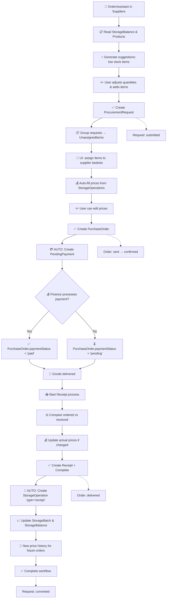

# 📋 Упрощенный Supplier Store - Финальное ТЗ

## 🎯 Основная концепция

**МИНИМАЛИСТИЧЕСКАЯ РЕАЛИЗАЦИЯ** - только самый необходимый функционал!

Supplier Store отвечает **ТОЛЬКО за workflow заказов**:

- ✅ Заявки на заказ (ProcurementRequest)
- ✅ Заказы поставщикам (PurchaseOrder)
- ✅ Приемка товара (Receipt)

**Все остальное вынесено в отдельные Store:**

- 🏪 **Поставщики** → CounterAgentsStore
- 💰 **Счета/Платежи** → AccountStore
- 📦 **Продукты** → ProductsStore
- 🏭 **Склад** → StorageStore

**Никаких лишних фич:** статистика, аналитика, сложные фильтры, дашборды - ТОЛЬКО базовый workflow!

---

## 📁 Структура проекта

```
/stores
  /supplier_2
    /composables
      useProcurementRequests.ts  // для работы с заявками
      usePurchaseOrders.ts       // для работы с заказами
      useReceipts.ts             // для работы с приемкой
      useOrderAssistant.ts       // для помощника заказов
    /mock
      supplierMock.ts
    index.ts
    types.ts
    supplierStore.ts
    supplierService.ts

/views
  /supplier_2
    /components
      /supplier_2
        BaseOrderAssistant.vue
        BaseSupplierBaskets.vue
        BaseReceiptDialog.vue
        ProcurementRequestTable.vue
        PurchaseOrderTable.vue
        ReceiptTable.vue
    SupplierView.vue
```

### **Composables структура:**

#### **useProcurementRequests.ts**

```typescript
export function useProcurementRequests() {
  // Работа с заявками:
  // - создание заявок
  // - получение списка заявок
  // - обновление статусов
  // - группировка для заказов
}
```

#### **usePurchaseOrders.ts**

```typescript
export function usePurchaseOrders() {
  // Работа с заказами:
  // - создание заказов из заявок
  // - управление статусами
  // - интеграция с AccountStore
  // - отслеживание платежей
}
```

#### **useReceipts.ts**

```typescript
export function useReceipts() {
  // Работа с приемкой:
  // - создание приемки
  // - сравнение план/факт
  // - интеграция с StorageStore
  // - обновление цен
}
```

#### **useOrderAssistant.ts**

```typescript
export function useOrderAssistant() {
  // Помощник заказов:
  // - анализ остатков
  // - генерация предложений
  // - автозаполнение цен
  // - создание заявок
}
```

---

## 📊 Complete WorkFlow



---

## 🏗️ TypeScript Types

### **1. Core Workflow Types**

```typescript
import type { BaseEntity } from '@/types/common'

// 1. Заявка на заказ (от отдела)
interface ProcurementRequest extends BaseEntity {
  requestNumber: string // "REQ-KITCHEN-001"
  department: 'kitchen' | 'bar'
  requestedBy: string

  items: RequestItem[]

  status: 'draft' | 'submitted' | 'converted' | 'cancelled'
  priority: 'normal' | 'urgent'

  // Связи
  purchaseOrderIds: string[] // PO созданные из этой заявки

  notes?: string
}

interface RequestItem {
  id: string
  itemId: string // связь с Product из ProductsStore
  itemName: string // кешированное название
  requestedQuantity: number
  unit: string
  notes?: string
}

// 2. Заказ поставщику
interface PurchaseOrder extends BaseEntity {
  orderNumber: string // "PO-001"
  supplierId: string // связь с Counteragent
  supplierName: string // кешированное название

  orderDate: string
  expectedDeliveryDate?: string

  items: OrderItem[]
  totalAmount: number // рассчитывается из items
  isEstimatedTotal: boolean // true если содержит предварительные цены

  status: 'draft' | 'sent' | 'confirmed' | 'delivered' | 'cancelled'
  paymentStatus: 'pending' | 'paid'

  // Связи с другими Store
  requestIds: string[] // откуда создан
  receiptId?: string // связь с приемкой
  billId?: string // связь со счетом в Account Store (PendingPayment.id)

  notes?: string
}

interface OrderItem {
  id: string
  itemId: string // связь с Product
  itemName: string
  orderedQuantity: number
  receivedQuantity?: number // заполняется при приемке
  unit: string
  pricePerUnit: number // автоматически заполняется из истории Storage operations
  totalPrice: number // рассчитывается автоматически

  // Информация о цене
  isEstimatedPrice: boolean // true если цена взята из истории
  lastPriceDate?: string // когда была последняя цена

  status: 'ordered' | 'received' | 'cancelled'
}

// 3. Приемка товара
interface Receipt extends BaseEntity {
  receiptNumber: string // "RCP-001"
  purchaseOrderId: string

  deliveryDate: string
  receivedBy: string

  items: ReceiptItem[]

  hasDiscrepancies: boolean
  status: 'draft' | 'completed'

  // Результат приемки - создает операцию в Storage Store
  storageOperationId?: string // StorageOperation.id (type: 'receipt')

  notes?: string
}

interface ReceiptItem {
  id: string
  orderItemId: string
  itemId: string
  itemName: string

  orderedQuantity: number
  receivedQuantity: number

  // Обновление цены при приемке
  orderedPrice: number // из заказа
  actualPrice?: number // фактическая цена при получении

  notes?: string
}
```

### **2. Store State (МИНИМАЛЬНЫЙ)**

```typescript
interface SupplierState {
  // Данные
  requests: ProcurementRequest[]
  orders: PurchaseOrder[]
  receipts: Receipt[]

  // UI состояние (только необходимое)
  loading: {
    requests: boolean
    orders: boolean
    receipts: boolean
    suggestions: boolean
  }

  // Текущий workflow (только активные объекты)
  currentRequest?: ProcurementRequest
  currentOrder?: PurchaseOrder
  currentReceipt?: Receipt

  // Для помощника заказов (минимум)
  selectedRequestIds: string[]
  orderSuggestions: OrderSuggestion[]

  // Для группировки по поставщикам (минимум)
  supplierBaskets: SupplierBasket[]
}
```

### **3. Helper Types (ТОЛЬКО НЕОБХОДИМЫЕ)**

```typescript
// Подсказки помощника заказов
interface OrderSuggestion {
  itemId: string
  itemName: string
  currentStock: number
  minStock: number
  suggestedQuantity: number
  urgency: 'low' | 'medium' | 'high'
  reason: 'below_minimum' | 'out_of_stock'
  estimatedPrice: number // автоматически из Storage операций
  lastPriceDate?: string
}

// Корзины поставщиков для UI распределения
interface SupplierBasket {
  supplierId: string | null // null = "Не распределено"
  supplierName: string
  items: UnassignedItem[]
  totalItems: number
  estimatedTotal: number // рассчитывается из прошлых цен
}

interface UnassignedItem {
  itemId: string
  itemName: string
  category: string // Product.category для фильтрации
  totalQuantity: number
  unit: string
  estimatedPrice: number // из истории Storage операций

  // Источники из разных заявок
  sources: {
    requestId: string
    requestNumber: string
    department: 'kitchen' | 'bar'
    quantity: number
  }[]
}
```

### **4. Create/Update Types (БАЗОВЫЕ)**

```typescript
interface CreateRequestData {
  department: 'kitchen' | 'bar'
  requestedBy: string
  items: Omit<RequestItem, 'id'>[]
  priority?: 'normal' | 'urgent'
  notes?: string
}

interface CreateOrderData {
  supplierId: string
  requestIds: string[]
  items: {
    itemId: string
    quantity: number
    pricePerUnit: number // заполняется автоматически из истории
  }[]
  expectedDeliveryDate?: string
  notes?: string
}

interface CreateReceiptData {
  purchaseOrderId: string
  receivedBy: string
  items: {
    orderItemId: string
    receivedQuantity: number
    actualPrice?: number // обновленная цена
    notes?: string
  }[]
  notes?: string
}
```

### **5. Integration Types (ТОЛЬКО СВЯЗИ)**

```typescript
// Связи с ProductsStore
interface ProductInfo {
  id: string // Product.id
  name: string // Product.name
  category: string // Product.category
  unit: string // Product.unit
  isActive: boolean // Product.isActive
  canBeSold: boolean // Product.canBeSold
}

// Связи с CounterAgentsStore
interface SupplierInfo {
  id: string // Counteragent.id
  name: string // Counteragent.name
  displayName: string // Counteragent.displayName
  type: 'supplier' // Counteragent.type
  paymentTerms: string // Counteragent.paymentTerms
  isActive: boolean // Counteragent.isActive
}

// Связи с StorageStore для получения истории цен
interface PriceHistory {
  itemId: string
  supplierId?: string
  pricePerUnit: number
  date: string
  operationId: string // StorageOperation.id
}

// Связи с AccountStore для создания счетов
interface CreateBillInAccountStore {
  counteragentId: string // supplierId
  counteragentName: string // supplierName
  amount: number // PurchaseOrder.totalAmount
  description: string // "Заказ #{orderNumber}"
  category: 'supplier' // PendingPayment.category
  invoiceNumber?: string // PurchaseOrder.orderNumber
  purchaseOrderId: string // metadata для связи
}

// Связи с StorageStore для создания поступления
interface CreateStorageReceipt {
  department: 'kitchen' | 'bar'
  responsiblePerson: string
  items: {
    itemId: string
    quantity: number
    costPerUnit: number // actualPrice или orderedPrice
    notes?: string
  }[]
  sourceType: 'purchase' // BatchSourceType
  purchaseOrderId: string // для связи
}
```

---

## 🔗 Store Integrations (ТОЛЬКО ЧТЕНИЕ/ЗАПИСЬ)

### **1. ProductsStore Integration**

#### **Supplier → ProductsStore (Read):**

```typescript
// OrderAssistant gets available products
function getAvailableProducts(department: 'kitchen' | 'bar'): ProductInfo[] {
  if (department === 'kitchen') {
    // Сырье для готовки (не продается напрямую)
    return productsStore.rawProducts.filter(p => p.isActive)
  } else {
    // Напитки для бара (продается напрямую)
    return productsStore.sellableProducts.filter(p => p.isActive && p.category === 'beverages')
  }
}

// Get product details for UI
function getProductInfo(itemId: string): ProductInfo {
  const product = productsStore.getProductById(itemId)
  return {
    id: product.id,
    name: product.name,
    category: product.category,
    unit: product.unit,
    isActive: product.isActive,
    canBeSold: product.canBeSold
  }
}
```

### **2. StorageStore Integration**

#### **StorageStore → Supplier (Read for suggestions):**

```typescript
// Get current stock levels for OrderAssistant
function getOrderSuggestions(department: 'kitchen' | 'bar'): OrderSuggestion[] {
  const balances = storageStore.departmentBalances(department)

  return balances
    .filter(balance => balance.belowMinStock || balance.totalQuantity === 0)
    .map(balance => ({
      itemId: balance.itemId,
      itemName: balance.itemName,
      currentStock: balance.totalQuantity,
      minStock: getMinStock(balance.itemId), // from Product
      suggestedQuantity: calculateSuggestion(balance),
      urgency: balance.totalQuantity === 0 ? 'high' : 'medium',
      reason: balance.totalQuantity === 0 ? 'out_of_stock' : 'below_minimum',
      estimatedPrice: balance.latestCost, // последняя цена из StorageBalance
      lastPriceDate: balance.newestBatchDate
    }))
}

// Get price history for auto-filling order prices
function getLastPrice(itemId: string, supplierId?: string): number {
  // Ищем в StorageOperations type='receipt' последнюю цену
  const operations = storageStore.operations.filter(
    op => op.operationType === 'receipt' && op.items.some(item => item.itemId === itemId)
  )

  // Если есть supplierId, фильтруем по поставщику через metadata
  // Иначе берем самую последнюю цену
  return operations[0]?.items.find(item => item.itemId === itemId)?.averageCostPerUnit || 0
}
```

#### **Supplier → StorageStore (Write on receipt):**

```typescript
// When receipt is completed, create StorageOperation
function createStorageReceipt(receipt: Receipt): Promise<StorageOperation> {
  const createData: CreateStorageReceipt = {
    department: receipt.department, // from PurchaseOrder
    responsiblePerson: receipt.receivedBy,
    items: receipt.items.map(item => ({
      itemId: item.itemId,
      quantity: item.receivedQuantity,
      costPerUnit: item.actualPrice || item.orderedPrice,
      notes: `PO: ${receipt.purchaseOrderId}`
    })),
    sourceType: 'purchase',
    purchaseOrderId: receipt.purchaseOrderId
  }

  return storageStore.createReceipt(createData)
}
```

### **3. CounterAgentsStore Integration**

#### **CounterAgentsStore → Supplier (Read suppliers):**

```typescript
// Get available suppliers for assignment
function getActiveSuppliers(): SupplierInfo[] {
  return counteragentsStore.supplierCounterAgents.map(supplier => ({
    id: supplier.id,
    name: supplier.name,
    displayName: supplier.displayName,
    type: 'supplier',
    paymentTerms: supplier.paymentTerms,
    isActive: supplier.isActive
  }))
}

// Get supplier for basket naming
function getSupplierInfo(supplierId: string): SupplierInfo {
  const supplier = counteragentsStore.getCounteragentById(supplierId)
  return {
    id: supplier.id,
    name: supplier.name,
    displayName: supplier.displayName
    // ... other fields
  }
}
```

### **4. AccountStore Integration**

#### **Supplier → AccountStore (Write bills):**

```typescript
// When PurchaseOrder is created, AUTOMATICALLY create PendingPayment
function createBillInAccount(order: PurchaseOrder): Promise<PendingPayment> {
  const billData: CreateBillInAccountStore = {
    counteragentId: order.supplierId,
    counteragentName: order.supplierName,
    amount: order.totalAmount,
    description: `Заказ ${order.orderNumber}`,
    category: 'supplier',
    invoiceNumber: order.orderNumber,
    purchaseOrderId: order.id, // metadata для связи
    priority: 'medium', // default
    createdBy: {
      type: 'user',
      id: getCurrentUser().id,
      name: getCurrentUser().name
    }
  }

  return accountStore.createPayment(billData)
}
```

#### **AccountStore → Supplier (Payment confirmation):**

```typescript
// When payment is processed, automatically update PurchaseOrder
function onPaymentProcessed(paymentId: string, transactionId: string) {
  // Find PurchaseOrder by billId
  const order = supplierStore.orders.find(o => o.billId === paymentId)
  if (order) {
    supplierStore.updateOrderPaymentStatus(order.id, 'paid')
  }
}
```

---

## 💰 Payment Flow - Детально

### **Step 3a: Автоматическое создание счета**

```typescript
// При создании PurchaseOrder автоматически:
async function createPurchaseOrder(orderData: CreateOrderData) {
  // 1. Создаем заказ
  const order = await supplierService.createOrder(orderData)

  // 2. АВТОМАТИЧЕСКИ создаем счет в Account Store
  const billData: CreatePaymentDto = {
    counteragentId: order.supplierId,
    counteragentName: order.supplierName,
    amount: order.totalAmount,
    description: `Заказ ${order.orderNumber}`,
    category: 'supplier',
    invoiceNumber: order.orderNumber,
    priority: 'medium', // по умолчанию
    createdBy: currentUser
  }

  const bill = await accountStore.createPayment(billData)

  // 3. Связываем заказ со счетом
  order.billId = bill.id
  order.paymentStatus = 'pending'

  return order
}
```

### **Step 3b: Обработка оплаты (отдельно)**

```typescript
// Позже, в Account Store, finance manager:
async function processPayment(paymentId: string, accountId: string) {
  // 1. Проводит платеж
  await accountStore.processPayment({
    paymentId,
    accountId,
    performedBy: financeManager
  })

  // 2. АВТОМАТИЧЕСКИ обновляется статус заказа
  const order = supplierStore.orders.find(o => o.billId === paymentId)
  if (order) {
    order.paymentStatus = 'paid'
  }
}
```

### **Синхронизация между Store:**

```typescript
// В supplierStore, слушаем изменения в accountStore
watch(
  () => accountStore.pendingPayments,
  payments => {
    // Обновляем статусы заказов при изменении платежей
    payments.forEach(payment => {
      const order = orders.find(o => o.billId === payment.id)
      if (order && payment.status === 'completed') {
        order.paymentStatus = 'paid'
      }
    })
  }
)
```

---

## 🎨 UI Structure (МИНИМАЛЬНАЯ)

### **Navigation:**

```
🏠 Dashboard
📦 Storage          ⬅️ существующий (OrderAssistant убираем отсюда)
🛒 Suppliers        ⬅️ НОВЫЙ модуль (с OrderAssistant внутри)
💰 Accounts         ⬅️ существующий
👥 Staff
📊 Reports
⚙️ Settings
```

### **SupplierView Structure (ПРОСТАЯ):**

```
┌─────────────────────────────────────────────┐
│ 🛒 Suppliers & Orders                       │
│ ├─ Tabs: [📋 Requests] [📦 Orders]         │
│ │         [📥 Receipts]                     │
│ │                                          │
│ ├─ Quick Actions:                          │
│ │  [🛒 Order Assistant]                    │
│ │                                          │
│ └─ Tab Content (простые таблицы)           │
└─────────────────────────────────────────────┘
```

### **OrderAssistant (простой modal):**

```
┌─────────────────────────────────────────────┐
│ 🛒 Order Assistant - Kitchen                │
│ ├─ Department: [Kitchen ▼] [Bar]           │
│ ├─ Auto Suggestions:                       │
│ │  ┌─────────────────────────────────────┐ │
│ │  │ ⚠️ Low Stock: Beef (0.3kg)          │ │
│ │  │ Suggested: [5] kg @ 180k            │ │
│ │  │ [✓ Add]                             │ │
│ │  └─────────────────────────────────────┘ │
│ │                                          │
│ ├─ Manual Add: [+ Add item ▼]             │
│ └─ [Cancel] [Create Request]               │
└─────────────────────────────────────────────┘
```

### **Supplier Assignment (простой):**

```
┌─────────────────────────────────────────────┐
│ 📦 Create Orders from Requests              │
│                                             │
│ ┌─ Не распределено ────────────────────────┐│
│ │ ☐ Beef (5kg) @ 180k                     ││
│ │ ☐ Milk (8L) @ 15k                       ││
│ │ [Assign to ▼]                           ││
│ └─────────────────────────────────────────┘│
│                                             │
│ ┌─ Premium Meat Co ─────────────────────────┐│
│ │ • Beef (2kg) @ 180k                     ││
│ │ [Create Order]                          ││
│ └─────────────────────────────────────────┘│
└─────────────────────────────────────────────┘
```

---

## 📅 Implementation Roadmap (ФОКУС НА МИНИМУМ)

### **Week 1: Mock Data & Basic Store**

- [ ] 🔲 `supplierMock.ts` - минимальные тестовые данные
- [ ] 🔲 `types.ts` - только необходимые типы
- [ ] 🔲 `supplierService.ts` - базовая логика с моками
- [ ] 🔲 `supplierStore.ts` - простой store без излишеств

### **Week 2: Composables & OrderAssistant**

- [ ] 🔲 `useOrderAssistant.ts` - логика помощника заказов
- [ ] 🔲 `useProcurementRequests.ts` - работа с заявками
- [ ] 🔲 `BaseOrderAssistant.vue` - простой компонент
- [ ] 🔲 Интеграция с StorageStore для подсказок

### **Week 3: Orders & Supplier Assignment**

- [ ] 🔲 `usePurchaseOrders.ts` - работа с заказами
- [ ] 🔲 `BaseSupplierBaskets.vue` - распределение по поставщикам
- [ ] 🔲 Интеграция с CounterAgentsStore
- [ ] 🔲 Интеграция с AccountStore (создание счетов)

### **Week 4: Receipts & Storage Integration**

- [ ] 🔲 `useReceipts.ts` - работа с приемкой
- [ ] 🔲 `BaseReceiptDialog.vue` - компонент приемки
- [ ] 🔲 Интеграция с StorageStore (создание операций)
- [ ] 🔲 Полный workflow тестирование

### **Week 5: UI & Polish**

- [ ] 🔲 `SupplierView.vue` - основной компонент
- [ ] 🔲 Простые таблицы для каждой сущности
- [ ] 🔲 Навигация и роутинг
- [ ] 🔲 Финальное тестирование

---

## 🎯 Composables Details

### **1. useOrderAssistant.ts**

```typescript
export function useOrderAssistant() {
  // State
  const suggestions = ref<OrderSuggestion[]>([])
  const selectedItems = ref<RequestItem[]>([])
  const isGenerating = ref(false)

  // Actions
  async function generateSuggestions(department: 'kitchen' | 'bar') {
    // Читаем данные из StorageStore
    // Анализируем остатки vs минимумы
    // Получаем цены из истории
  }

  function addSuggestionToRequest(suggestion: OrderSuggestion) {
    // Добавляем в заявку
  }

  async function createRequestFromItems(data: CreateRequestData) {
    // Создаем заявку через supplierStore
  }

  return {
    suggestions,
    selectedItems,
    isGenerating,
    generateSuggestions,
    addSuggestionToRequest,
    createRequestFromItems
  }
}
```

### **2. useProcurementRequests.ts**

```typescript
export function useProcurementRequests() {
  // State
  const requests = computed(() => supplierStore.requests)
  const currentRequest = computed(() => supplierStore.currentRequest)

  // Actions
  async function createRequest(data: CreateRequestData) {
    return supplierStore.createRequest(data)
  }

  async function updateRequestStatus(id: string, status: RequestStatus) {
    return supplierStore.updateRequestStatus(id, status)
  }

  function groupRequestsForOrders(requestIds: string[]): SupplierBasket[] {
    // Группируем товары по поставщикам
    // Возвращаем корзины для UI
  }

  return {
    requests,
    currentRequest,
    createRequest,
    updateRequestStatus,
    groupRequestsForOrders
  }
}
```

### **3. usePurchaseOrders.ts**

```typescript
export function usePurchaseOrders() {
  // State
  const orders = computed(() => supplierStore.orders)
  const currentOrder = computed(() => supplierStore.currentOrder)

  // Actions
  async function createOrderFromBasket(basket: SupplierBasket) {
    // Создаем заказ
    // Автоматически создаем счет в AccountStore
    return supplierStore.createOrder(orderData)
  }

  async function updateOrderStatus(id: string, status: OrderStatus) {
    return supplierStore.updateOrderStatus(id, status)
  }

  function getOrdersWithPaymentStatus() {
    // Объединяем данные с AccountStore
    return orders.value.map(order => ({
      ...order,
      paymentInfo: getPaymentInfo(order.billId)
    }))
  }

  return {
    orders,
    currentOrder,
    createOrderFromBasket,
    updateOrderStatus,
    getOrdersWithPaymentStatus
  }
}
```

### **4. useReceipts.ts**

```typescript
export function useReceipts() {
  // State
  const receipts = computed(() => supplierStore.receipts)
  const currentReceipt = computed(() => supplierStore.currentReceipt)

  // Actions
  async function startReceipt(purchaseOrderId: string) {
    return supplierStore.startReceipt(purchaseOrderId)
  }

  async function completeReceipt(receiptData: CreateReceiptData) {
    // Завершаем приемку
    // Автоматически создаем StorageOperation
    return supplierStore.completeReceipt(receiptData)
  }

  function calculateDiscrepancies(receipt: Receipt): DiscrepancySummary {
    // Анализируем расхождения
    // Рассчитываем финансовое влияние
  }

  return {
    receipts,
    currentReceipt,
    startReceipt,
    completeReceipt,
    calculateDiscrepancies
  }
}
```

-# 📋 Упрощенный Supplier Store - Финальное ТЗ

## 🎯 Основная концепция

Supplier Store отвечает **ТОЛЬКО за workflow заказов**:

- ✅ Заявки на заказ (ProcurementRequest)
- ✅ Заказы поставщикам (PurchaseOrder)
- ✅ Приемка товара (Receipt)

**Все остальное вынесено в отдельные Store:**

- 🏪 **Поставщики** → CounterAgentsStore
- 💰 **Счета/Платежи** → AccountStore
- 📦 **Продукты** → ProductsStore
- 🏭 **Склад** → StorageStore

---

## 📊 Complete WorkFlow


---

## 🏗️ TypeScript Types

### **1. Core Workflow Types**

```typescript
import type { BaseEntity } from '@/types/common'

// 1. Заявка на заказ (от отдела)
interface ProcurementRequest extends BaseEntity {
  requestNumber: string // "REQ-KITCHEN-001"
  department: 'kitchen' | 'bar'
  requestedBy: string

  items: RequestItem[]

  status: 'draft' | 'submitted' | 'converted' | 'cancelled'
  priority: 'normal' | 'urgent'

  // Связи
  purchaseOrderIds: string[] // PO созданные из этой заявки

  notes?: string
}

interface RequestItem {
  id: string
  itemId: string // связь с Product из ProductsStore
  itemName: string // кешированное название
  requestedQuantity: number
  unit: string
  notes?: string
}

// 2. Заказ поставщику
interface PurchaseOrder extends BaseEntity {
  orderNumber: string // "PO-001"
  supplierId: string // связь с Counteragent
  supplierName: string // кешированное название

  orderDate: string
  expectedDeliveryDate?: string

  items: OrderItem[]
  totalAmount: number // рассчитывается из items
  isEstimatedTotal: boolean // true если содержит предварительные цены

  status: 'draft' | 'sent' | 'confirmed' | 'delivered' | 'cancelled'
  paymentStatus: 'pending' | 'paid'

  // Связи с другими Store
  requestIds: string[] // откуда создан
  receiptId?: string // связь с приемкой
  billId?: string // связь со счетом в Account Store (PendingPayment.id)

  notes?: string
}

interface OrderItem {
  id: string
  itemId: string // связь с Product
  itemName: string
  orderedQuantity: number
  receivedQuantity?: number // заполняется при приемке
  unit: string
  pricePerUnit: number // автоматически заполняется из истории Storage operations
  totalPrice: number // рассчитывается автоматически

  // Информация о цене
  isEstimatedPrice: boolean // true если цена взята из истории
  lastPriceDate?: string // когда была последняя цена

  status: 'ordered' | 'received' | 'cancelled'
}

// 3. Приемка товара
interface Receipt extends BaseEntity {
  receiptNumber: string // "RCP-001"
  purchaseOrderId: string

  deliveryDate: string
  receivedBy: string

  items: ReceiptItem[]

  hasDiscrepancies: boolean
  status: 'draft' | 'completed'

  // Результат приемки - создает операцию в Storage Store
  storageOperationId?: string // StorageOperation.id (type: 'receipt')

  notes?: string
}

interface ReceiptItem {
  id: string
  orderItemId: string
  itemId: string
  itemName: string

  orderedQuantity: number
  receivedQuantity: number

  // Обновление цены при приемке
  orderedPrice: number // из заказа
  actualPrice?: number // фактическая цена при получении

  notes?: string
}
```

### **2. Store State**

```typescript
interface SupplierState {
  // Данные
  requests: ProcurementRequest[]
  orders: PurchaseOrder[]
  receipts: Receipt[]

  // UI состояние
  loading: {
    requests: boolean
    orders: boolean
    receipts: boolean
    suggestions: boolean
  }

  // Текущий workflow
  currentRequest?: ProcurementRequest
  currentOrder?: PurchaseOrder
  currentReceipt?: Receipt

  // Для помощника заказов
  selectedRequestIds: string[]
  orderSuggestions: OrderSuggestion[]

  // Для группировки по поставщикам
  supplierBaskets: SupplierBasket[]
}
```

### **3. Helper Types**

```typescript
// Подсказки помощника заказов
interface OrderSuggestion {
  itemId: string
  itemName: string
  currentStock: number
  minStock: number
  suggestedQuantity: number
  urgency: 'low' | 'medium' | 'high'
  reason: 'below_minimum' | 'out_of_stock'
  estimatedPrice: number // автоматически из Storage операций
  lastPriceDate?: string
}

// Корзины поставщиков для UI распределения
interface SupplierBasket {
  supplierId: string | null // null = "Не распределено"
  supplierName: string
  items: UnassignedItem[]
  totalItems: number
  estimatedTotal: number // рассчитывается из прошлых цен
}

interface UnassignedItem {
  itemId: string
  itemName: string
  category: string // Product.category для фильтрации
  totalQuantity: number
  unit: string
  estimatedPrice: number // из истории Storage операций

  // Источники из разных заявок
  sources: {
    requestId: string
    requestNumber: string
    department: 'kitchen' | 'bar'
    quantity: number
  }[]
}
```

### **4. Create/Update Types**

```typescript
interface CreateRequestData {
  department: 'kitchen' | 'bar'
  requestedBy: string
  items: Omit<RequestItem, 'id'>[]
  priority?: 'normal' | 'urgent'
  notes?: string
}

interface CreateOrderData {
  supplierId: string
  requestIds: string[]
  items: {
    itemId: string
    quantity: number
    pricePerUnit: number // заполняется автоматически из истории
  }[]
  expectedDeliveryDate?: string
  notes?: string
}

interface CreateReceiptData {
  purchaseOrderId: string
  receivedBy: string
  items: {
    orderItemId: string
    receivedQuantity: number
    actualPrice?: number // обновленная цена
    notes?: string
  }[]
  notes?: string
}
```

### **5. Integration Types**

```typescript
// Связи с ProductsStore
interface ProductInfo {
  id: string // Product.id
  name: string // Product.name
  category: string // Product.category
  unit: string // Product.unit
  isActive: boolean // Product.isActive
  canBeSold: boolean // Product.canBeSold
}

// Связи с CounterAgentsStore
interface SupplierInfo {
  id: string // Counteragent.id
  name: string // Counteragent.name
  displayName: string // Counteragent.displayName
  type: 'supplier' // Counteragent.type
  paymentTerms: string // Counteragent.paymentTerms
  isActive: boolean // Counteragent.isActive
}

// Связи с StorageStore для получения истории цен
interface PriceHistory {
  itemId: string
  supplierId?: string
  pricePerUnit: number
  date: string
  operationId: string // StorageOperation.id
}

// Связи с AccountStore для создания счетов
interface CreateBillInAccountStore {
  counteragentId: string // supplierId
  counteragentName: string // supplierName
  amount: number // PurchaseOrder.totalAmount
  description: string // "Заказ #{orderNumber}"
  category: 'supplier' // PendingPayment.category
  invoiceNumber?: string // PurchaseOrder.orderNumber
  purchaseOrderId: string // metadata для связи
}

// Связи с StorageStore для создания поступления
interface CreateStorageReceipt {
  department: 'kitchen' | 'bar'
  responsiblePerson: string
  items: {
    itemId: string
    quantity: number
    costPerUnit: number // actualPrice или orderedPrice
    notes?: string
  }[]
  sourceType: 'purchase' // BatchSourceType
  purchaseOrderId: string // для связи
}
```

---

## 🔗 Store Integrations

### **1. ProductsStore Integration**

#### **Supplier → ProductsStore (Read):**

```typescript
// OrderAssistant gets available products
function getAvailableProducts(department: 'kitchen' | 'bar'): ProductInfo[] {
  if (department === 'kitchen') {
    // Сырье для готовки (не продается напрямую)
    return productsStore.rawProducts.filter(p => p.isActive)
  } else {
    // Напитки для бара (продается напрямую)
    return productsStore.sellableProducts.filter(p => p.isActive && p.category === 'beverages')
  }
}

// Get product details for UI
function getProductInfo(itemId: string): ProductInfo {
  const product = productsStore.getProductById(itemId)
  return {
    id: product.id,
    name: product.name,
    category: product.category,
    unit: product.unit,
    isActive: product.isActive,
    canBeSold: product.canBeSold
  }
}
```

### **2. StorageStore Integration**

#### **StorageStore → Supplier (Read for suggestions):**

```typescript
// Get current stock levels for OrderAssistant
function getOrderSuggestions(department: 'kitchen' | 'bar'): OrderSuggestion[] {
  const balances = storageStore.departmentBalances(department)

  return balances
    .filter(balance => balance.belowMinStock || balance.totalQuantity === 0)
    .map(balance => ({
      itemId: balance.itemId,
      itemName: balance.itemName,
      currentStock: balance.totalQuantity,
      minStock: getMinStock(balance.itemId), // from Product
      suggestedQuantity: calculateSuggestion(balance),
      urgency: balance.totalQuantity === 0 ? 'high' : 'medium',
      reason: balance.totalQuantity === 0 ? 'out_of_stock' : 'below_minimum',
      estimatedPrice: balance.latestCost, // последняя цена из StorageBalance
      lastPriceDate: balance.newestBatchDate
    }))
}

// Get price history for auto-filling order prices
function getLastPrice(itemId: string, supplierId?: string): number {
  // Ищем в StorageOperations type='receipt' последнюю цену
  const operations = storageStore.operations.filter(
    op => op.operationType === 'receipt' && op.items.some(item => item.itemId === itemId)
  )

  // Если есть supplierId, фильтруем по поставщику через metadata
  // Иначе берем самую последнюю цену
  return operations[0]?.items.find(item => item.itemId === itemId)?.averageCostPerUnit || 0
}
```

#### **Supplier → StorageStore (Write on receipt):**

```typescript
// When receipt is completed, create StorageOperation
function createStorageReceipt(receipt: Receipt): Promise<StorageOperation> {
  const createData: CreateStorageReceipt = {
    department: receipt.department, // from PurchaseOrder
    responsiblePerson: receipt.receivedBy,
    items: receipt.items.map(item => ({
      itemId: item.itemId,
      quantity: item.receivedQuantity,
      costPerUnit: item.actualPrice || item.orderedPrice,
      notes: `PO: ${receipt.purchaseOrderId}`
    })),
    sourceType: 'purchase',
    purchaseOrderId: receipt.purchaseOrderId
  }

  return storageStore.createReceipt(createData)
}
```

### **3. CounterAgentsStore Integration**

#### **CounterAgentsStore → Supplier (Read suppliers):**

```typescript
// Get available suppliers for assignment
function getActiveSuppliers(): SupplierInfo[] {
  return counteragentsStore.supplierCounterAgents.map(supplier => ({
    id: supplier.id,
    name: supplier.name,
    displayName: supplier.displayName,
    type: 'supplier',
    paymentTerms: supplier.paymentTerms,
    isActive: supplier.isActive
  }))
}

// Get supplier for basket naming
function getSupplierInfo(supplierId: string): SupplierInfo {
  const supplier = counteragentsStore.getCounteragentById(supplierId)
  return {
    id: supplier.id,
    name: supplier.name,
    displayName: supplier.displayName
    // ... other fields
  }
}
```

### **4. AccountStore Integration**

#### **Supplier → AccountStore (Write bills):**

```typescript
// When PurchaseOrder is created, AUTOMATICALLY create PendingPayment
function createBillInAccount(order: PurchaseOrder): Promise<PendingPayment> {
  const billData: CreateBillInAccountStore = {
    counteragentId: order.supplierId,
    counteragentName: order.supplierName,
    amount: order.totalAmount,
    description: `Заказ ${order.orderNumber}`,
    category: 'supplier',
    invoiceNumber: order.orderNumber,
    purchaseOrderId: order.id, // metadata для связи
    priority: 'medium', // default
    createdBy: {
      type: 'user',
      id: getCurrentUser().id,
      name: getCurrentUser().name
    }
  }

  return accountStore.createPayment(billData)
}
```

#### **AccountStore → Supplier (Payment confirmation):**

```typescript
// When payment is processed, automatically update PurchaseOrder
function onPaymentProcessed(paymentId: string, transactionId: string) {
  // Find PurchaseOrder by billId
  const order = supplierStore.orders.find(o => o.billId === paymentId)
  if (order) {
    supplierStore.updateOrderPaymentStatus(order.id, 'paid')
  }
}
```

---

## 💰 Payment Flow - Детально

### **Step 3a: Автоматическое создание счета**

```typescript
// При создании PurchaseOrder автоматически:
async function createPurchaseOrder(orderData: CreateOrderData) {
  // 1. Создаем заказ
  const order = await supplierService.createOrder(orderData)

  // 2. АВТОМАТИЧЕСКИ создаем счет в Account Store
  const billData: CreatePaymentDto = {
    counteragentId: order.supplierId,
    counteragentName: order.supplierName,
    amount: order.totalAmount,
    description: `Заказ ${order.orderNumber}`,
    category: 'supplier',
    invoiceNumber: order.orderNumber,
    priority: 'medium', // по умолчанию
    createdBy: currentUser
  }

  const bill = await accountStore.createPayment(billData)

  // 3. Связываем заказ со счетом
  order.billId = bill.id
  order.paymentStatus = 'pending'

  return order
}
```

### **Step 3b: Обработка оплаты (отдельно)**

```typescript
// Позже, в Account Store, finance manager:
async function processPayment(paymentId: string, accountId: string) {
  // 1. Проводит платеж
  await accountStore.processPayment({
    paymentId,
    accountId,
    performedBy: financeManager
  })

  // 2. АВТОМАТИЧЕСКИ обновляется статус заказа
  const order = supplierStore.orders.find(o => o.billId === paymentId)
  if (order) {
    order.paymentStatus = 'paid'
  }
}
```

### **Синхронизация между Store:**

```typescript
// В supplierStore, слушаем изменения в accountStore
watch(
  () => accountStore.pendingPayments,
  payments => {
    // Обновляем статусы заказов при изменении платежей
    payments.forEach(payment => {
      const order = orders.find(o => o.billId === payment.id)
      if (order && payment.status === 'completed') {
        order.paymentStatus = 'paid'
      }
    })
  }
)
```

---

## 🎨 UI Structure

### **Navigation:**

```
🏠 Dashboard
📦 Storage          ⬅️ существующий (OrderAssistant убираем отсюда)
🛒 Suppliers        ⬅️ НОВЫЙ модуль (с OrderAssistant внутри)
💰 Accounts         ⬅️ существующий
👥 Staff
📊 Reports
⚙️ Settings
```

### **SupplierView Structure:**

```
┌─────────────────────────────────────────────┐
│ 🛒 Suppliers & Orders                       │
│ ├─ Tabs: [📋 Requests] [📦 Orders]         │
│ │         [📥 Receipts] [📊 Overview]       │
│ │                                          │
│ ├─ Quick Actions:                          │
│ │  [🛒 Order Assistant] [📊 Quick Stats]   │
│ │                                          │
│ └─ Tab Content (зависит от выбранной)      │
└─────────────────────────────────────────────┘
```

### **OrderAssistant (modal in Suppliers):**

```
┌─────────────────────────────────────────────┐
│ 🛒 Order Assistant - Kitchen                │
│ ├─ Department: [Kitchen ▼] [Bar]           │
│ ├─ Auto Suggestions:                       │
│ │  ┌─────────────────────────────────────┐ │
│ │  │ ⚠️ URGENT: Out of Stock             │ │
│ │  │ 🥩 Beef Steak: 0kg (min: 2kg)       │ │
│ │  │ Suggested: [5] kg @ 180k/kg         │ │
│ │  │ Last price: 3 days ago              │ │
│ │  │ [✓ Add to request]                  │ │
│ │  └─────────────────────────────────────┘ │
│ │                                          │
│ ├─ Manual Add: [+ Add item ▼]             │
│ ├─ Request Summary:                        │
│ │  • 3 items, est. 2.4M IDR               │
│ │                                          │
│ └─ [Cancel] [Create Request]               │
└─────────────────────────────────────────────┘
```

### **Supplier Assignment UI:**

```
┌─────────────────────────────────────────────┐
│ 📦 Create Orders from Requests              │
│                                             │
│ ┌─ Filters ────────────────────────────────┐│
│ │ Category: [All ▼] [Meat] [Vegetables]    ││
│ │ [✓ Select All] [Clear Selection]         ││
│ └─────────────────────────────────────────┘│
│                                             │
│ ┌─ Не распределено (12 товаров) ───────────┐│
│ │ ☐ 🥩 Beef (5kg) @ 180k                  ││
│ │ ☐ 🥛 Milk (8L) @ 15k                    ││
│ │ [Assign to Supplier ▼]                  ││
│ └─────────────────────────────────────────┘│
│                                             │
│ ┌─ Premium Meat Co (3 товара) ─────────────┐│
│ │ • 🥩 Beef Steak (2kg) @ 180k            ││
│ │ • 🐔 Chicken (5kg) @ 120k               ││
│ │ Total: ~900k IDR                        ││
│ │ [Create Order] [Clear]                  ││
│ └─────────────────────────────────────────┘│
└─────────────────────────────────────────────┘
```

---

## 📅 Implementation Roadmap

### **Week 1: Core Foundation**

- [x] ✅ Создание упрощенных типов
- [ ] 🔲 `supplierService.ts` с базовой логикой
- [ ] 🔲 Mock данные для тестирования
- [ ] 🔲 `supplierStore.ts` с базовыми actions

### **Week 2: OrderAssistant & Requests**

- [ ] 🔲 `OrderAssistantDialog.vue` с подсказками
- [ ] 🔲 ProcurementRequest создание и управление
- [ ] 🔲 Интеграция с StorageStore для остатков

### **Week 3: Supplier Assignment & Orders**

- [ ] 🔲 UI для распределения по поставщикам
- [ ] 🔲 PurchaseOrder создание с автоценами
- [ ] 🔲 Интеграция с CounterAgentsStore

### **Week 4: Receipt & Integration**

- [ ] 🔲 Receipt компонент для приемки
- [ ] 🔲 Интеграция с StorageStore (создание операций)
- [ ] 🔲 Интеграция с AccountStore (создание счетов)

### **Week 5: Polish & Testing**

- [ ] 🔲 Тестирование полного workflow
- [ ] 🔲 Оптимизация производительности
- [ ] 🔲 UX улучшения

---

## 🎯 Critical Data Links

| From Store             | To Store         | Field Mapping                                                  | Purpose                  |
| ---------------------- | ---------------- | -------------------------------------------------------------- | ------------------------ |
| **ProductsStore**      | **Supplier**     | `Product.id` → `RequestItem.itemId`                            | Product catalog          |
| **StorageStore**       | **Supplier**     | `StorageBalance.latestCost` → `OrderSuggestion.estimatedPrice` | Price history            |
| **Supplier**           | **StorageStore** | `Receipt` → `CreateReceiptData`                                | Create receipt operation |
| **Supplier**           | **AccountStore** | `PurchaseOrder` → `CreatePaymentDto`                           | Create bills             |
| **AccountStore**       | **Supplier**     | `PendingPayment.id` → `PurchaseOrder.billId`                   | Link payments            |
| **CounterAgentsStore** | **Supplier**     | `Counteragent.id` → `PurchaseOrder.supplierId`                 | Supplier info            |

---

## 🚀 Success Criteria

### **Functional Requirements:**

- ✅ OrderAssistant с подсказками на основе остатков
- ✅ Простое распределение товаров по поставщикам
- ✅ Автозаполнение цен из истории Storage операций
- ✅ Автоматическое создание счетов при заказе
- ✅ Полная интеграция с приемкой на склад

### **Technical Requirements:**

- ✅ Четкие связи между Store без дублирования данных
- ✅ Автоматическая синхронизация статусов платежей
- ✅ FIFO учет при создании Storage операций
- ✅ Минимальный и понятный UI

**Этот упрощенный подход фокусируется только на workflow заказов, используя существующие Store для всех остальных функций! 🚀**
